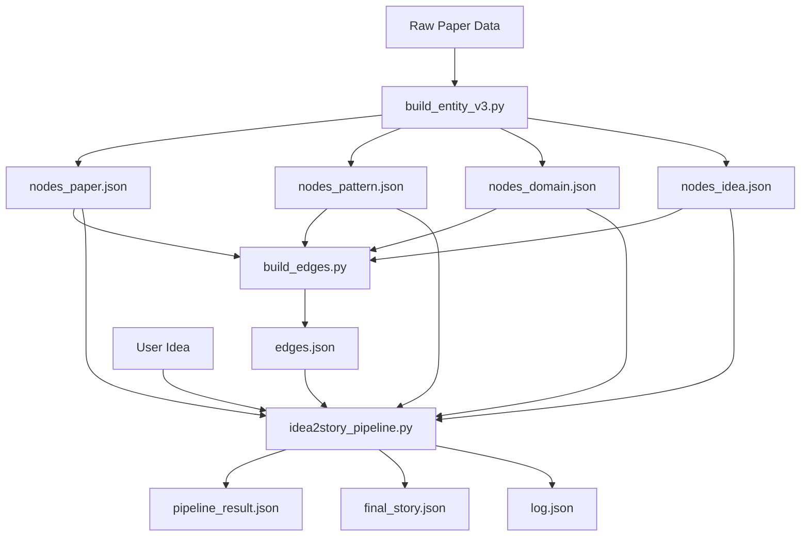

# Output Files Explained

This document explains how the JSON files in the `Paper-KG-Pipeline/output/` directory are created and what they contain.

## 📋 Table of Contents

- [Knowledge Graph Node Files](#knowledge-graph-node-files)
- [Knowledge Graph Edge Files](#knowledge-graph-edge-files)
- [Pattern Files](#pattern-files)
- [Pipeline Output Files](#pipeline-output-files)
- [Build Process Overview](#build-process-overview)

---

## Knowledge Graph Node Files

The knowledge graph consists of four types of nodes, each stored in separate JSON files.

### 📄 `nodes_paper.json`

**Generated by**: `scripts/tools/build_entity.py` or `scripts/tools/build_entity_v3.py`

**Purpose**: Contains paper nodes with their metadata, including skeleton (abstract structure), tricks (technical details), and review information.

**Structure**:
```json
{
  "paper_id": {
    "paper_id": "unique_identifier",
    "title": "Paper Title",
    "authors": ["Author1", "Author2"],
    "abstract": "Paper abstract text...",
    "skeleton": "Structured abstract representation",
    "tricks": "Technical implementation details",
    "review_stats": {
      "rating": 7.5,
      "confidence": 4.0,
      ...
    },
    ...
  }
}
```

**Data sources**:
- v2: `data/{conference}/*_paper_node.json`
- v3: ICLR data from `assignments.jsonl` and cluster data

---

### 📄 `nodes_pattern.json`

**Generated by**: `scripts/tools/build_entity.py` or `scripts/tools/build_entity_v3.py`

**Purpose**: Contains writing pattern nodes representing common research paradigms extracted from papers.

**Structure**:
```json
{
  "pattern_id": {
    "pattern_id": "unique_identifier",
    "pattern_name": "Pattern Name",
    "description": "Pattern description",
    "skeleton_template": "Abstract structure template",
    "trick_template": "Technical approach template",
    "example_papers": ["paper_id1", "paper_id2"],
    "cluster_size": 42,
    "rank": 5,
    ...
  }
}
```

**Data sources**:
- Generated from `patterns_structured.json` which is created by clustering paper skeletons and tricks

---

### 📄 `nodes_domain.json`

**Generated by**: `scripts/tools/build_entity.py` or `scripts/tools/build_entity_v3.py`

**Purpose**: Contains research domain nodes representing broad research areas.

**Structure**:
```json
{
  "domain_id": {
    "domain_id": "unique_identifier",
    "domain_name": "Domain Name",
    "description": "Domain description",
    "related_papers": ["paper_id1", "paper_id2"],
    "keywords": ["keyword1", "keyword2"],
    ...
  }
}
```

**Data sources**:
- Extracted from paper metadata and conference tracks
- Derived from topic modeling or clustering of papers

---

### 📄 `nodes_idea.json`

**Generated by**: `scripts/tools/build_entity.py` or `scripts/tools/build_entity_v3.py`

**Purpose**: Contains core innovation idea nodes extracted from papers, representing key research contributions.

**Structure**:
```json
{
  "idea_id": {
    "idea_id": "unique_identifier",
    "idea_text": "Description of the core idea",
    "source_papers": ["paper_id1", "paper_id2"],
    "related_patterns": ["pattern_id1"],
    "novelty_score": 0.85,
    ...
  }
}
```

**Data sources**:
- Extracted from paper abstracts, contributions sections
- Generated via LLM analysis of paper content

---

## Knowledge Graph Edge Files

### 📄 `edges.json`

**Generated by**: `scripts/tools/build_edges.py`

**Purpose**: Contains all edges connecting nodes in the knowledge graph, supporting the three-path retrieval system.

**Edge Types**:
1. **Paper → Idea**: Links papers to their core ideas
2. **Idea → Domain**: Links ideas to research domains
3. **Paper → Pattern**: Links papers to their writing patterns
4. **Domain → Pattern**: Links domains to common patterns used
5. **Pattern → Idea**: Links patterns to related ideas
6. **Idea → Idea**: Links similar ideas (computed at runtime)
7. **Paper → Paper**: Links similar papers (computed via content similarity)

**Structure**:
```json
{
  "edges": [
    {
      "source": "node_id_1",
      "target": "node_id_2",
      "edge_type": "paper_to_idea",
      "weight": 0.95,
      "metadata": {...}
    },
    ...
  ]
}
```

**Retrieval Paths Supported**:
- **Path 1**: Idea → Idea → Pattern (similar idea recall)
- **Path 2**: Idea → Domain → Pattern (domain-based recall)
- **Path 3**: Idea → Paper → Pattern (similar paper recall)

---

## Pattern Files

### 📄 `patterns_structured.json`

**Generated by**: `scripts/tools/generate_patterns.py`

**Purpose**: Contains structured pattern data created by clustering paper skeletons and tricks.

**Creation Process**:
1. Extract skeletons (abstract structures) and tricks (technical details) from papers
2. Use LLM to cluster similar skeletons and tricks
3. Generate pattern templates and metadata
4. Rank patterns by cluster size and quality

**Structure**:
```json
{
  "patterns": [
    {
      "pattern_id": "pattern_001",
      "skeleton_cluster": {
        "representative": "Abstract structure template",
        "members": ["paper_id1", "paper_id2"],
        "size": 42
      },
      "trick_cluster": {
        "representative": "Technical approach template",
        "members": ["paper_id3", "paper_id4"],
        "size": 38
      },
      "rank": 5,
      ...
    }
  ]
}
```

---

### 📄 `patterns_guide.txt`

**Generated by**: `scripts/tools/generate_patterns.py`

**Purpose**: Human-readable guide of all patterns with examples.

**Content**: Text descriptions of each pattern with usage examples and paper references.

---

### 📄 `patterns_statistics.json`

**Generated by**: `scripts/tools/generate_patterns.py`

**Purpose**: Statistical summary of pattern distribution and quality metrics.

---

## Pipeline Output Files

### 📄 `pipeline_result.json`

**Generated by**: `scripts/idea2story_pipeline.py` (main pipeline entry point)

**Purpose**: Complete trace of the pipeline execution, including all stages, reviews, corrections, and audits.

**Structure**:
```json
{
  "run_id": "run_20240204_123456",
  "input_idea": "Original research idea text",
  "config": {...},
  "stages": {
    "phase1_pattern_selection": {
      "selected_patterns": [...],
      "recall_candidates": [...],
      ...
    },
    "phase2_story_generation": {
      "generated_stories": [...],
      ...
    },
    "phase3_review": {
      "reviews": [...],
      "scores": {...},
      ...
    },
    "phase4_verification": {
      "collision_check": {...},
      ...
    }
  },
  "final_story": {...},
  "metadata": {
    "duration_seconds": 245.3,
    "llm_calls": 42,
    ...
  }
}
```

---

### 📄 `final_story.json`

**Generated by**: `scripts/idea2story_pipeline.py` (extracted from pipeline result)

**Purpose**: The final generated research story with structured fields ready for paper writing.

**Structure**:
```json
{
  "title": "Generated Paper Title",
  "abstract": "Generated abstract text...",
  "problem": "Research problem statement",
  "method": "Proposed method description",
  "contributions": ["Contribution 1", "Contribution 2"],
  "experiments": "Experimental setup and results",
  "pattern_used": "pattern_id",
  "novelty_score": 0.85,
  "review_scores": {
    "relevance": 8.5,
    "clarity": 7.8,
    "novelty": 8.2
  }
}
```

---

### 📄 `log.json`

**Generated by**: Pipeline execution with logging enabled

**Purpose**: Detailed execution log for debugging and auditing.

**Structure**: JSONL format (one JSON object per line) with timestamped events.

---

## Build Process Overview

### Step-by-Step Creation Flow



### Build Commands

1. **Build Knowledge Graph Nodes** (one-time setup):
   ```bash
   python Paper-KG-Pipeline/scripts/tools/build_entity_v3.py
   ```
   
   Creates: `nodes_paper.json`, `nodes_pattern.json`, `nodes_domain.json`, `nodes_idea.json`

2. **Build Knowledge Graph Edges** (one-time setup):
   ```bash
   python Paper-KG-Pipeline/scripts/tools/build_edges.py
   ```
   
   Creates: `edges.json`

3. **Generate Patterns** (optional, if not included in step 1):
   ```bash
   python Paper-KG-Pipeline/scripts/tools/generate_patterns.py
   ```
   
   Creates: `patterns_structured.json`, `patterns_guide.txt`, `patterns_statistics.json`

4. **Run Pipeline** (generates research story):
   ```bash
   python Paper-KG-Pipeline/scripts/idea2story_pipeline.py "Your research idea"
   ```
   
   Creates: `pipeline_result.json`, `final_story.json`, `log.json`

---

## File Dependencies

```
Raw Data (papers/)
    ↓
nodes_*.json (4 files) ← build_entity_v3.py
    ↓
edges.json ← build_edges.py (reads nodes_*.json)
    ↓
pipeline outputs ← idea2story_pipeline.py (reads edges.json + nodes_*.json)
    ├── pipeline_result.json
    ├── final_story.json
    └── log.json
```

---

## Important Notes

1. **Entity Builder Versions**:
   - `build_entity.py` (v2): Uses generic conference data format
   - `build_entity_v3.py` (v3): ICLR-specific, recommended for current setup
   - Use only ONE version to avoid conflicts

2. **Index Files**:
   - `novelty_index/` and `recall_index/` directories contain pre-computed embeddings
   - These are built automatically or via `build_novelty_index.py` and `build_recall_index.py`
   - Must be rebuilt if embedding model changes

3. **Incremental Updates**:
   - Node files: Can be regenerated independently
   - Edge file: Depends on node files, regenerate after node updates
   - Pipeline outputs: Generated per run, not cumulative

---

## Troubleshooting

**Q: Missing output files after running pipeline?**
- Check that knowledge graph files exist: `nodes_*.json` and `edges.json`
- Run build scripts in order: entities first, then edges
- Check logs for error messages

**Q: Pipeline results different between runs?**
- LLM responses are non-deterministic (temperature > 0)
- Set `seed` parameter for more consistent results
- Check that indexes haven't changed

**Q: Large file sizes?**
- `nodes_paper.json`: ~15MB (contains full paper metadata)
- `edges.json`: ~90MB (contains all graph edges)
- These files are loaded into memory during pipeline execution

---

## See Also

- [Knowledge Graph Construction Guide](01_KG_CONSTRUCTION.md)
- [Recall System Documentation](02_RECALL_SYSTEM.md)
- [Idea2Story Pipeline Guide](03_IDEA2STORY_PIPELINE.md)
- [Project Overview](00_PROJECT_OVERVIEW.md)
